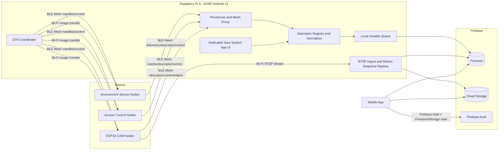
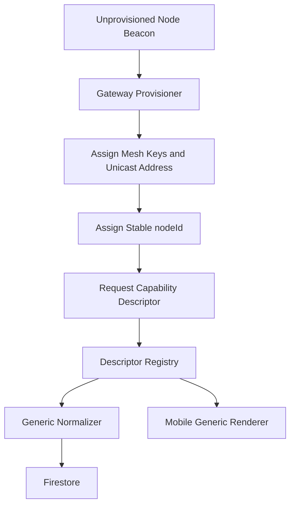
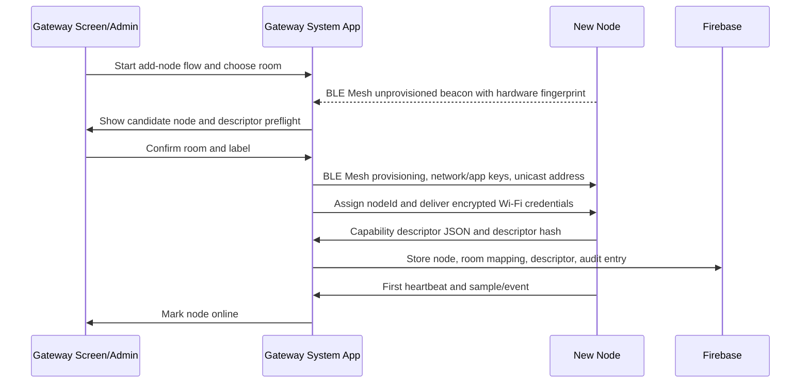
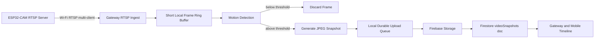
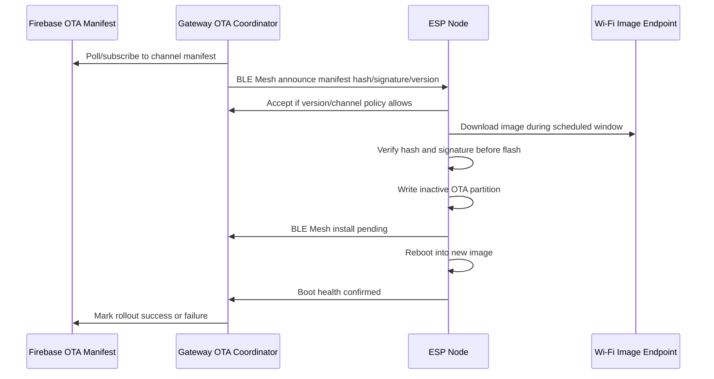
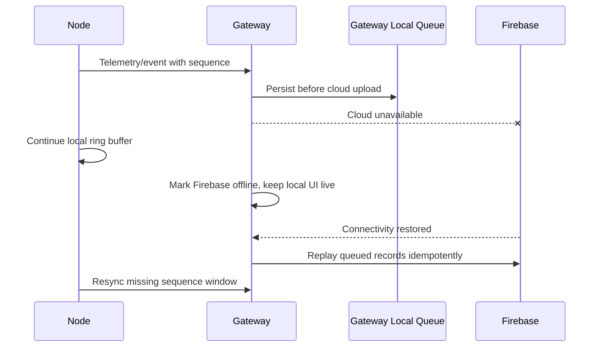
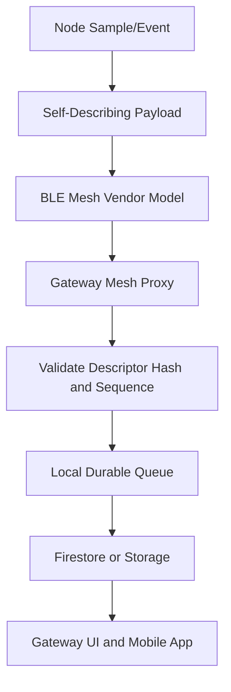

# Smart Home 3-Tier Architecture

## Open Questions

The following items remain ambiguous in the specification and are deliberately left as `[TBD]` instead of being guessed:

- Exact GPIO pin assignments, UART baud rates, SPI wiring, ADC scaling circuits, relay drive polarity, MQ7 heater drive circuit, and GP2Y1014 LED timing: `[TBD: needs datasheet and board schematic]`.
- BLE Mesh vendor company identifier, vendor model IDs, opcode numbers, publication periods, and relay/friend/LPN settings: `[TBD: allocate after Bluetooth SIG company/model planning]`.
- Firebase project ID, region, Storage bucket, Cloud Functions region, and production IAM/service-account setup: `[TBD: deployment owner]`.
- Final snapshot/video retention duration required by household policy and applicable law. This design uses configurable defaults, not hard-coded retention.
- Exact RTSP library capability on ESP32-CAM for TLS/SRTP. Link-level Wi-Fi encryption is required; application-layer stream encryption is `[TBD: validate library support]`.
- OTA code-signing key custody, signing environment, and release approval workflow: `[TBD: operations/security owner]`.
- Exact room taxonomy, floor naming, device label format, and physical QR/label printing process: `[TBD: installation owner]`.

## Fixed Decisions From Prompt Resolution

- Existing ESP node projects stay as PlatformIO projects using the ESP-IDF framework. The existing ESP-IDF CMake files remain authoritative; no Arduino scaffold is introduced.
- OTA is hybrid: BLE Mesh carries signed manifest/control/rollback signals, and Wi-Fi carries bulk firmware images.
- Capability descriptors use integer `schemaVersion: 1`. Fields added within a version must be optional/additive. Breaking field type, field meaning, or removal changes require a schema version bump. Gateway and mobile clients must ignore unknown fields.
- DHT22 is the primary ambient temperature/humidity source. CJMCU680/BME680 temperature and humidity are secondary and must be offset-compensated before cross-checking because the BME680 gas heater can self-heat.
- Raw fingerprint templates and raw RFID UIDs do not leave the access node. TZM1026 matching stays on the module; gateway/Firebase receive only salted hashes, enrollment/match metadata, timestamps, result, room ID, and node ID.
- The `hardwareFingerprint` HMAC salt is a per-home `homeSecret` — a 256-bit random value generated once during initial home setup and stored in Android Keystore-backed storage on the gateway. It is never synced to Firestore in plaintext. `homeId` is not used as the salt because it is a semi-public identifier visible to all home members and would allow fingerprint spoofing. No rotation is needed — the secret is stable for the lifetime of the home.

## Component and Language Choices   

| Component | Path | Language/scaffold | Rationale |
| --- | --- | --- | --- |
| Environment Sensor Node | `/home/huynn/smart_home/node_sensor_enviroment` | C, ESP-IDF via existing PlatformIO project | Matches existing project files and gives direct ESP32-S3 BLE Mesh, Wi-Fi, NVS, ADC, and OTA support. |
| Access Control Node | `/home/huynn/smart_home/node_rfid_finger_print` | C, ESP-IDF via existing PlatformIO project | Matches existing project files and supports UART, SPI, GPIO relay control, local secure storage, BLE Mesh, Wi-Fi, and OTA. |
| Camera Node | `/home/huynn/smart_home/node_camera` | C, ESP-IDF via existing PlatformIO project | Matches existing ESP32-CAM project and keeps RTSP, camera driver, Wi-Fi, BLE Mesh control, and OTA in one native firmware scaffold. |
| Gateway System App | `/home/huynn/aosp/source/packages/apps/SmartHomeSystem` | Java system app stubs | The spec fixes a Java AOSP Android 15 system app on Raspberry Pi 4. |
| Mobile App | `/home/huynn/smart_home/smart_home_mobile_app` | Java Android app stubs | Existing mobile app is Java; keeping Java avoids mixed Kotlin/Java scaffolding. |

## End-to-End Architecture



Rationale: the gateway is the only component that provisions the mesh, normalizes node data, talks to Firebase, and ingests camera video. Nodes remain simple, rooms can contain many identical nodes, and mobile clients do not need direct BLE/Wi-Fi access to the devices.

## 1. Data Schema

### Common Node Identity

`nodeId` is assigned by the gateway during provisioning and stored in node NVS. It is not a room name and does not change when the node moves.

```json
{
  "nodeId": "node_018f5c8a4f6a7b2c9d10e11f",
  "homeId": "home_01HV...",
  "nodeType": "environment.sensor",
  "hardwareFingerprint": "sha256:hmac-of-efuse-or-camera-mac",
  "descriptorSchemaVersion": 1,
  "descriptorHash": "sha256:...",
  "location": {
    "roomId": "room_kitchen",
    "label": "Kitchen ceiling east",
    "installedAt": "2026-06-27T00:00:00Z"
  },
  "firmware": {
    "version": "0.0.0-stub",
    "buildId": "stub",
    "otaChannel": "stable"
  },
  "lastSeenAt": "2026-06-27T00:00:00Z",
  "status": "online"
}
```

### Reading Envelope

All sensor readings use UTC timestamps. Nodes send a monotonic `sequence` and best-effort `observedAtEpochMs`; the gateway adds `gatewayReceivedAt` and Firebase adds `uploadedAt`.

```json
{
  "readingId": "node_018f..._00000042",
  "nodeId": "node_018f5c8a4f6a7b2c9d10e11f",
  "roomId": "room_kitchen",
  "sequence": 66,
  "observedAtEpochMs": 1782518400000,
  "gatewayReceivedAt": "2026-06-27T00:00:01Z",
  "uploadedAt": "serverTimestamp",
  "metrics": {
    "ambientTemperature": {
      "value": 27.4,
      "unit": "degC",
      "source": "DHT22",
      "quality": "primary"
    },
    "relativeHumidity": {
      "value": 62.1,
      "unit": "percent_rh",
      "source": "DHT22",
      "quality": "primary"
    },
    "co": {
      "value": 4.2,
      "unit": "ppm",
      "source": "MQ7",
      "quality": "valid_after_heater_cycle",
      "heaterPhase": "sample"
    },
    "pm25": {
      "value": 11.8,
      "unit": "ug_m3",
      "source": "GP2Y1014",
      "quality": "sampled"
    },
    "pressure": {
      "value": 1008.6,
      "unit": "hPa",
      "source": "CJMCU680",
      "quality": "sampled"
    },
    "eco2": {
      "value": 640,
      "unit": "ppm",
      "source": "CJMCU680",
      "quality": "algorithm_estimate"
    },
    "tvoc": {
      "value": 78,
      "unit": "ppb",
      "source": "CJMCU680",
      "quality": "algorithm_estimate"
    }
  },
  "diagnostics": {
    "temperatureDeltaAfterCompensation": 0.6,
    "temperatureDeltaUnit": "degC",
    "sensorFaultFlags": []
  }
}
```

### Access Event Envelope

```json
{
  "eventId": "node_access_018f..._00000017",
  "nodeId": "node_access_018f...",
  "roomId": "room_entry",
  "eventType": "access.attempt",
  "observedAtEpochMs": 1782518400000,
  "gatewayReceivedAt": "2026-06-27T00:00:01Z",
  "uploadedAt": "serverTimestamp",
  "result": "granted",
  "credential": {
    "kind": "fingerprint",
    "hashedEnrollmentId": "sha256:salted-node-local-id",
    "rawTemplateStored": false,
    "rawUidStored": false
  },
  "actuator": {
    "kind": "door_lock_relay",
    "commandedState": "unlock_pulse",
    "relayPin": "[TBD: needs datasheet]"
  }
}
```

### Video Snapshot Envelope

```json
{
  "snapshotId": "snap_node_cam_018f..._20260627T000001Z",
  "nodeId": "node_cam_018f...",
  "roomId": "room_living",
  "eventType": "video.motion_snapshot",
  "observedAt": "2026-06-27T00:00:01Z",
  "gatewayReceivedAt": "2026-06-27T00:00:02Z",
  "uploadedAt": "serverTimestamp",
  "storagePath": "homes/home_01HV/videoSnapshots/2026/06/27/snap_node_cam_018f...jpg",
  "contentType": "image/jpeg",
  "widthPx": 1280,
  "heightPx": 720,
  "motion": {
    "algorithm": "frame_difference_stub",
    "score": 0.72,
    "threshold": 0.55
  },
  "retention": {
    "snapshotRetentionDays": 30,
    "metadataRetentionDays": 180,
    "configurable": true
  }
}
```

### Firestore Structure

```text
homes/{homeId}
homes/{homeId}/rooms/{roomId}
homes/{homeId}/nodes/{nodeId}
homes/{homeId}/nodes/{nodeId}/readings/{readingId}
homes/{homeId}/events/{eventId}
homes/{homeId}/videoSnapshots/{snapshotId}
homes/{homeId}/descriptors/{descriptorHash}
homes/{homeId}/otaChannels/{channelId}
homes/{homeId}/otaChannels/{channelId}/manifests/{manifestId}
homes/{homeId}/alerts/{alertId}
homes/{homeId}/auditLog/{auditId}
```

Rationale: node-local subcollections support efficient collection-group queries for readings while preserving node ownership. Generic `events`, `descriptors`, and `videoSnapshots` collections allow future node types without new top-level schema.

## 2. System Architecture

BLE Mesh carries low-bandwidth, reliable control-plane data: provisioning, descriptors, heartbeats, telemetry, access events, OTA manifests, and rollback signals. Wi-Fi carries high-bandwidth data: camera RTSP, Firebase sync from gateway, and OTA image transfer.

The gateway acts as:

- BLE Mesh provisioner for new nodes.
- BLE Mesh proxy and vendor-model client/server.
- Descriptor registry that stores each node capability JSON by hash.
- Data normalizer that maps descriptors to Firestore documents.
- Wi-Fi credential broker during provisioning.
- Camera RTSP client and snapshot processor.
- OTA coordinator.



Coexistence policy:

- BLE Mesh remains always available for control, heartbeats, and provisioning.
- Nodes schedule Wi-Fi transfers in windows announced over BLE Mesh to reduce 2.4 GHz contention.
- Camera nodes keep RTSP on Wi-Fi but report stream status and control metadata over BLE Mesh.
- Telemetry messages include `sequence` and `ttl` so the gateway can deduplicate relayed packets.

Rationale: BLE Mesh is appropriate for many small, identical nodes and multi-room coverage. Wi-Fi is appropriate for bandwidth-heavy streams and firmware images. Keeping the gateway as provisioner/proxy centralizes trust and routing.

## 3. Provisioning and Onboarding



Step-by-step workflow:

1. Installer powers a node in onboarding mode.
2. Gateway scans BLE Mesh unprovisioned beacons and displays hardware fingerprint or QR/label match.
3. Installer selects room, placement label, and optional friendly name.
4. Gateway assigns `nodeId` as a UUID-style stable identifier and stores `hardwareFingerprint -> nodeId`.
5. Gateway provisions BLE Mesh network and app keys and stores mesh unicast routing metadata.
6. Gateway sends Wi-Fi credentials encrypted to the provisioned node over the mesh application key.
7. Node stores `nodeId`, Wi-Fi profile, mesh keys, and descriptor hash in NVS.
8. Gateway requests the self-describing descriptor over the vendor model `[TBD: model ID]`.
9. Gateway validates descriptor shape, stores it in Firestore, then renders controls from descriptor fields.
10. Gateway waits for a heartbeat and first data message before marking the node online.

Rationale: ID assignment and room mapping happen together but remain separate. Replacing or moving hardware updates mappings without changing the node ID contract used by readings and events.

## 4. Self-Describing Protocol

The descriptor is JSON exchanged over a BLE Mesh vendor model. The vendor model ID is not assigned here because it must be allocated deliberately.

```json
{
  "schemaVersion": 1,
  "nodeType": "environment.sensor",
  "displayName": "Environment Sensor Node",
  "firmware": {
    "version": "0.0.0-stub",
    "minGatewayDescriptorVersion": 1
  },
  "transports": {
    "bleMesh": {
      "vendorModel": "[TBD: allocate company/model ID]",
      "supportsProvisioning": true
    },
    "wifi": {
      "requiredFor": ["otaImageTransfer"],
      "optionalFor": []
    }
  },
  "metrics": [
    {
      "key": "ambientTemperature",
      "unit": "degC",
      "source": "DHT22",
      "role": "primary",
      "type": "number"
    },
    {
      "key": "relativeHumidity",
      "unit": "percent_rh",
      "source": "DHT22",
      "role": "primary",
      "type": "number"
    }
  ],
  "events": [
    {
      "key": "sensor.fault",
      "severity": "warning",
      "payloadSchema": "generic-key-value"
    }
  ],
  "actions": [],
  "ota": {
    "channel": "stable",
    "imageTransport": "wifi",
    "controlTransport": "ble_mesh"
  }
}
```

Gateway behavior:

- Accept descriptors with known `schemaVersion`.
- Ignore unknown fields.
- Reject only missing required core fields: `schemaVersion`, `nodeType`, `metrics/events/actions`, `firmware`, and `transports`.
- Store the raw descriptor by `descriptorHash`.
- Use descriptor fields to render mobile/gateway UI generically.

Rationale: the gateway and mobile app do not need code changes for new node types if the node describes metrics, events, actions, units, display names, and security requirements.

## 5. Video Processing Pipeline



Pipeline:

- Camera node exposes RTSP on Wi-Fi and participates in BLE Mesh for descriptor, status, and OTA control.
- Gateway opens the RTSP stream and maintains a short in-memory frame ring.
- Motion detection initially uses frame differencing as a placeholder algorithm; production CV/ML is out of scope.
- Only event snapshots are uploaded. Continuous raw video is not stored by default.
- Snapshot metadata is stored in Firestore and JPEG objects are stored in Firebase Storage.
- Default retention is configurable: snapshots 30 days, metadata 180 days, with final values tracked as an Open Question.

Rationale: processing video at the gateway keeps camera nodes lightweight, reduces cloud cost, and allows local privacy controls before any image leaves the home.

## 6. OTA Update Management



Node firmware OTA:

- Manifest contains `targetNodeType`, `hardwareRevision`, `fromVersion`, `toVersion`, `imageUrl`, `sha256`, `signature`, `minBatteryOrPowerState`, and `rollbackPolicy`.
- BLE Mesh distributes the signed manifest and update commands.
- Wi-Fi transfers the bulk image from a gateway-local cache or Firebase Storage signed URL.
- Node verifies hash and signature before flashing.
- Node writes the inactive OTA partition and reboots.
- Node must confirm boot health over BLE Mesh within a timeout or rollback.

Gateway app OTA:

- Gateway app reports version and channel to Firestore.
- App package updates must use Android/AOSP-supported signed update channels or package manager flows; the app must not self-install unsigned code.
- Gateway app treats Firestore OTA state as policy/visibility, not as a bypass around Android signing.

Rationale: BLE Mesh is too slow for firmware images but is reliable for control and rollback. Android system app updates must preserve platform signing and system-app integrity.

## 7. Fault Tolerance and Offline Behaviour



Behaviour:

- Nodes maintain a small NVS ring buffer for readings/events when gateway is unreachable. Exact size is `[TBD: partition sizing]`.
- Gateway persists incoming records to a local durable queue before Firebase upload.
- All readings/events use deterministic IDs with `nodeId + sequence` so retries are idempotent.
- Gateway detects offline nodes using heartbeat timeout: `offline` after three missed heartbeat periods, `stale` after one missed period.
- Gateway raises Firestore alerts for offline nodes, repeated sensor faults, access-control failures, and camera stream loss.
- Mobile app reads the last known status from Firestore and shows stale/offline state from `lastSeenAt`.

Rationale: local buffering prevents data loss during cloud outages, while deterministic IDs make replay safe after reconnect.

## 8. Security and Privacy

Transport and authentication:

- BLE Mesh provisioning uses authenticated provisioning where hardware labels/QR codes can provide OOB verification.
- BLE Mesh network/app keys protect mesh payloads; OTA manifests are additionally signed.
- Wi-Fi uses WPA2/WPA3 credentials delivered only after BLE Mesh provisioning.
- Gateway-to-Firebase uses TLS through Firebase SDKs.
- Camera RTSP is restricted to the gateway on the encrypted home Wi-Fi network. If streams cross untrusted networks, RTSPS/SRTP or a gateway-terminated encrypted tunnel is required and must be validated.
- Mobile app users authenticate with Firebase Auth.
- Gateway system app runs as a dedicated, privileged local UI with local admin authorization for provisioning and door-control actions.

Firebase access control:

- Users can read only homes where they are members.
- Only the gateway service identity can write readings, events, descriptors, snapshots, node status, and OTA rollout status.
- Mobile clients can request actions by writing command-request documents, but gateway validates and executes commands.
- Access-control commands require elevated roles and audit-log entries.

Biometric/RFID/video handling:

- Raw fingerprint templates never leave TZM1026/module storage.
- Raw RFID UIDs never leave the access node after hashing.
- Firestore stores only salted hashes, match/enrollment IDs, result, node ID, room ID, and timestamps.
- Snapshot upload is motion/event based only; continuous video is not stored by default.
- Retention and delete policies must be enforced by Cloud Storage lifecycle rules and Firestore cleanup jobs.

Rationale: this minimizes sensitive data movement, keeps biometric matching local, and limits cloud data to what the mobile and gateway workflows need.

## 9. Unique ID and Location Strategy

Identity layers:

- `hardwareFingerprint`: HMAC-SHA-256 of immutable hardware data (ESP32 eFuse MAC or camera MAC) keyed with the per-home `homeSecret`. The `homeSecret` is a 256-bit random value generated once during initial home setup and stored in Android Keystore-backed storage on the gateway. It is never synced to Firestore in plaintext and does not need rotation. Used only to recognize physical hardware during provisioning.
- `nodeId`: gateway-assigned stable ID stored on the node and used in all readings/events.
- `roomId`: separate location mapping stored in Firestore.
- `placementLabel`: human-readable physical placement, such as "entry door inside wall".

Mapping maintenance:

- Moving a node updates `roomId` and `placementLabel`; historical readings keep their original `roomId` snapshot.
- Replacing a failed node creates a new `nodeId` and may link to the old node via `replacesNodeId`.
- Decommissioning marks `status = retired` rather than deleting historical records.
- Physical labels should include QR data for hardware fingerprint and onboarding nonce, not raw keys.

Rationale: separating identity from location supports many identical nodes, room moves, replacement, and historical audit accuracy.

## 10. Sensor Fusion

Temperature/humidity policy:

- DHT22 is the official ambient temperature and relative humidity source written as primary metrics.
- CJMCU680/BME680 temperature/humidity are recorded as secondary diagnostics only after offset compensation.
- Offset compensation is learned during steady-state periods by comparing DHT22 and CJMCU680 readings over time.
- Gateway/node reports both raw secondary and compensated delta in diagnostics when available.
- A sensor fault is raised only when compensated deltas exceed configured thresholds for a sustained window.

Other sensors:

- MQ7 CO readings are valid only after heater cycle state says sampling is valid.
- GP2Y1014 PM2.5 readings include sample timing quality but no invented pin/timing values until the board schematic is known.
- CJMCU680 pressure, IAQ, eCO2, and TVOC are reported with algorithm-estimate quality markers where applicable.

Rationale: BME680 gas heater self-heating can make its temperature high versus room ambient. Using DHT22 as primary and CJMCU680 as compensated cross-check avoids false discrepancy alerts while still detecting sensor drift/faults.

## Data Pipeline Summary



The gateway normalizer never hard-codes a node-specific payload class as the only path. It reads the descriptor, validates declared metric/event keys, attaches location/status metadata, and writes the generic Firestore envelopes.

